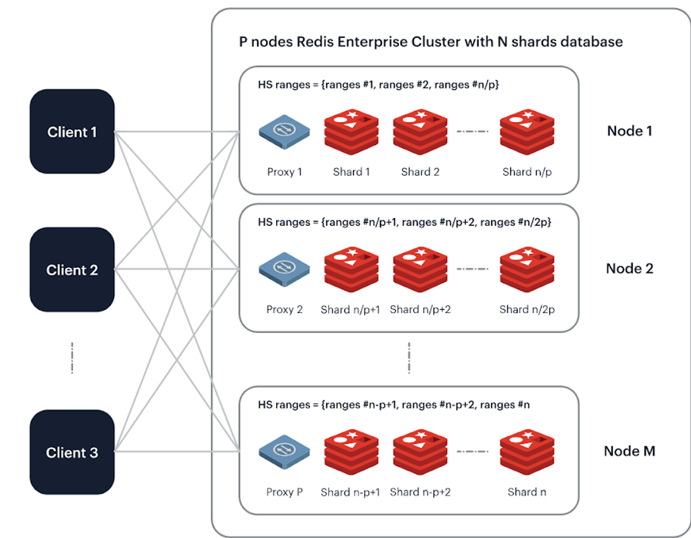
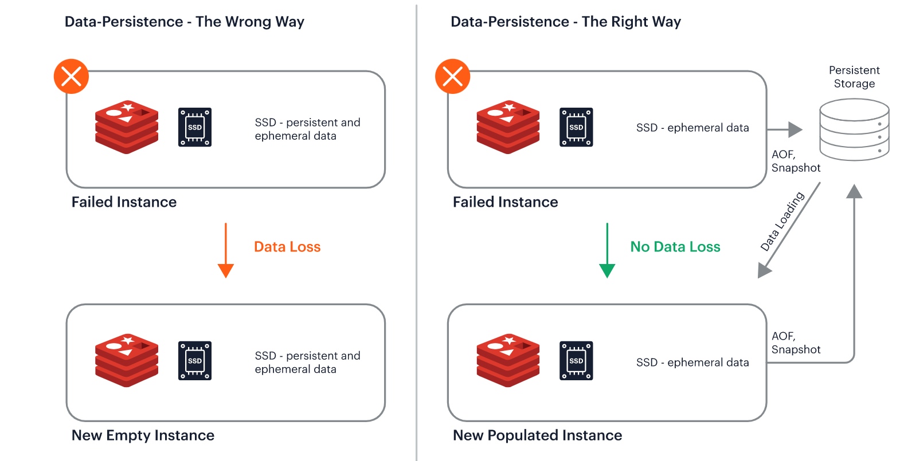

## Introduction

Are you looking for ways to improve the performance and scalability of your technical stack? Look no further than Redis! In this blog, you will explore various ways in which you can make Redis work for you. By the end of this blog, you will have a good understanding of how to use Redis to your advantage and unlock its full potential. So, without further ado, let's dive in!

## Defining Redis

Redis, is an open-source caching and database service, making it a popular choice among many modern applications. It is the most popular in-memory database because it stores datasets in memory, making it incredibly fast and efficient when working with data.

> 💡 *Redis stands for REmote DIctionary Server*

Redis offers an attractive option for applications that require fast and easy access to data streams. Its speed and NoSQL capabilities make it a prime choice for handling complex data sets and providing real-time analytics.

### **Use Cases**

Redis (Remote Dictionary Server) is a fast, in-memory, data structure store that can be used as a database, cache, and message broker. Here are some common use cases for Redis:

* Caching
* Session Management
* Real-time Analytics
* Leaderboards/Counting
* Queueing and Pub/Sub \*\*\*\*messaging
* Gaming
* Machine learning
* Geospatial processing
* IoT

Developers are turning their heads to Redis due to its high performance, fast data retrieval, and overall reliability as a primary database.

## Redis as a Primary Database

Redis is a data structure server that can be used as a primary database. It's a key-value store, which means it stores data in the form of keys and values. These keys can be simple strings like "user.profile"

### **Benefits of Using Redis**

A multi-model database, like Redis, can be a useful tool for managing data. It can serve as an in-memory database for various types of applications.

Here are some of the advantages of using Redis as a database:

* High Performance
* Multi-Model Database
* Scalability
* Durability

These benefits make Redis an ideal choice for many applications that need high performance and scalability while also providing the ability to store multiple types of data in one single system.

### **Understanding How Redis Functions With Modules**

Redis is designed with modules that support various operations, such as pub/sub messaging and caching.

Here are some ways to use Redis as a database:

**Caching:** Redis can store frequently accessed data in memory, which can help reduce resource utilization and improve application response times.

Source: devgenious.io

**Session Management:** Redis can store session information, allowing faster access to user information across requests.

Source: [jinchoy.oopi.io](http://jinchoy.oopi.io)

**Pub/Sub Messaging:** Redis's Pub/Sub messaging system enables developers to send messages between applications or services in real-time without having to depend on centralized message queues.

Source: jinchoy.oopi.io

**Data Replication & Persistence:** Redis provides features like data replication and persistence, which make it easy to back up and restore data in case of an outage or system failure.

Source: educba.com

**High Availability & Scalability:** Redis makes it easy to scale out applications by adding new nodes when needed, helping ensure that applications remain available even during periods of high load.

Source: redis.io

## Redis as a Multi-Model Database

Using Redis as a multi-model database makes it easy to access different data types without switching between multiple databases. This database reduces the time spent on switching databases and simplifies the development process, as all data can be accessed through a single source.

Additionally, since Redis is an in-memory database, it can provide faster read/write speeds than traditional disk-based databases.

Source: redis.io

Redis's multi-model feature allows users to store data in a variety of formats, such as:

* Strings
* Hashes
* Lists
* Sets
* Sorted sets
* Typos.
* Bitmaps

Source: webmedis.com

These structures allow developers to work with any data without worrying about compatibility or data structure issues.

## ***How can Redis Protect its Data and Ensure that the Information is Not Lost?***

Redis can protect its data and ensure that the information is not lost by using various persistence options such as RDB, AOF and snapshots.

## Durability Through Snapshotting and AOF in Redis:

***Snapshotting*** and ***AOF*** (Append-Only File) are two essential features of Redis that guarantee durability and data safety. Snapshotting is a mechanism in which the data stored in Redis is saved to a disk at regular intervals. This way, if the whole database disappears, you can use the snapshot to recover it. However, remember that this won't save any data created or changed during the last few minutes before the snapshot was taken.

AOF is another feature of Redis that ensures the durability and reliability of the data stored in it. It works by writing all the changes made to the database into a file on disk. As such, if you ever need to restore your database from scratch, you can replay all the recorded changes from this file and get back up and running quickly. Both snapshotting and AOF ensure that your data remains safe even when things go wrong with your database.

Source: redis.io

Although users can choose between these different mechanisms depending on their use case, snapshotting is useful for a point-in-time backup of data and AOF for a more granular data recovery.

<aside>
💡 \*Redis does not have a built-in backup feature. However, it does provide a way to create a snapshot of the current data set by using the command SAVE, which saves the data to disk in the RDB format. Additionally, Redis also has an BGSAVE command that creates a snapshot in the background, allowing the Redis server to continue accepting commands while the snapshot is being saved.\*

</aside>

Additionally, Redis can also be configured to replicate data to multiple servers, providing a way to ensure that data is not lost even if one server goes down.

It is also recommended to use Redis with a proper backup solution such as 'Redis Enterprise' or with a cluster solution like 'Redis Cluster' to ensure data high-availability and disaster recovery.

## Scaling The Database For Improved Performance:

First, let's go over some basic concepts related to scaling Redis. When scaling your Redis database, you'll need to consider how much data you're storing, the number of users accessing the data, and the read/write operations occurring at any given time.

The larger the amount of data stored in Redis, the more memory it will need. Additionally, increasing the number of users or read/write operations can lead to increased latency if not managed properly.

The two most effective ways of scaling a Redis database are ***clustering*** and ***sharding***.

***Clustering*** allows you to create multiple nodes linked together as one logical unit. This way, if one node fails, the other nodes can still serve requests. Clustering also allows you to increase the memory size of your database without sacrificing its performance.

🧠Learn more about [Redis Clustering](https://github.com/search?q=redis+clustering)

***Sharding*** is another way to scale your Redis database by breaking it into multiple smaller databases called shards. Each shard contains only a portion of the data, which helps spread the load across multiple servers. This also increases the overall capacity of your database and helps prevent it from becoming overloaded with requests.

By using clustering and sharding, you can ensure that your Redis database can handle large amounts of data while providing fast response times. With these techniques, you can ensure that your

### **Other Ways You Can Scale Your Redis Database:**

**1) Increase Capacity:** To increase capacity in your Redis database, you'll want to add more nodes (servers) to handle additional requests and store additional data. This can be done by adding more physical servers or virtual machines for added flexibility.

**2) Increase Memory Size:** If you need additional memory for your Redis instances, several options are available depending on your specific needs. One option is to add more RAM or swap space to existing servers; however, this may come at the cost of reduced performance and should be done only when necessary.

**3) Utilize Replication:** Replication allows you to keep multiple copies of your data across different physical nodes, which helps improve availability and performance while also providing redundancy should one server fail.

## Conclusion

In conclusion, Redis is a great option to help scale an architecture if you're looking for a data store that is fast, powerful, and easy to use. A big benefit of using Redis is the ability to combine the multiple data models into one system while retaining all the benefits that they each provide. And because of its speed, you can use it to cache other systems that might be slower over time. Overall though, I hope this article has provided you with some valuable insight into what Redis is and how it works, along with some suggestions for when you might want to consider using it.

If you're interested to learn more about the DevOps as a whole, please feel free to check out my website and read my blogs <https://safoorsafdar.com/posts>